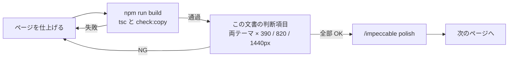

# ページ仕上げの pre-flight

ページを 1 つ仕上げるたびに通す確認。`design-taste-frontend` の Section 14 から、この 1 枚サイトに当てはまる項目だけを抜いた。スキル本文は約 87KB あり、毎回読むと文脈を圧迫するため、新しいセクションや部品を足すときだけ全文を読む。

## 機械で検査する項目

`npm run build` が `scripts/check-copy.mjs` を走らせる。次の 2 つは目で確認しない。

- 見える文字列にエムダッシュ (`—`) とエンダッシュ (`–`) がない。範囲は `Mar 2026 - Present` のようにハイフンで書く。
- 1 行に中黒 (`·`) が 2 つ以上ない。区切りはカンマにする。

## 判断で確認する項目

- 全セクションで、アクセントの使い方が同じ。途中のセクションだけテーマが反転しない。
- 角の丸みが 0 で揃っている。影を足していない。
- ボタン、リンク、フォーカスの輪が、ダークとライトの両方で AA (4.5:1) を満たす。
- CTA の文言がデスクトップで折り返さない。同じ意図の CTA が 2 つない。
- ヒーローが 1 画面に収まり、文字要素が 4 つ以内。
- ヒーロー下端の装飾の文字帯、`Scroll` の誘導、版数表記、現地時刻や天気の帯がない。
- 状態を表さない色付きの点がない。
- 画面に出る文字を全部読み直し、AI 風の言い回しや壊れた文がない。
- 動きの理由を一文で言える。`prefers-reduced-motion` で止まる。
- ダークとライトの両方で、390px、820px、1440px を実際に見た。

DESIGN.md が採用している要素 (番号付きの行など) は、スキル側の禁止項目より DESIGN.md を優先する。
